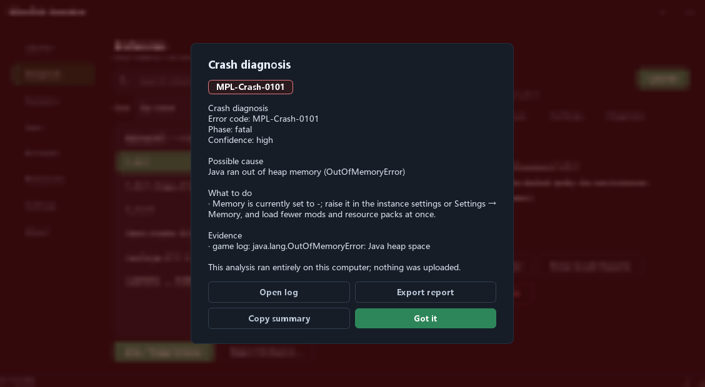

**English** | [简体中文](README_zh.md) | [繁體中文](README_zh_TW.md) | [日本語](README_ja.md) | [한국어](README_ko.md) | [Русский](README_ru.md) | [Français](README_fr.md) | [Español](README_es.md) | [Deutsch](README_de.md)

# MinePick Launcher

A portable Minecraft launcher built with Python + PySide6: Microsoft/offline accounts, version installation,
Modrinth & CurseForge resources, Fabric/Forge/NeoForge/Quilt loaders, isolated instances — packaged as a
single portable EXE.

**Current release: 0.3.0** — a GUI build only: this repository ships no command-line executable.

## Screenshots

<table>
  <tr>
    <td></td>
    <td></td>
  </tr>
  <tr>
    <td align="center"><sub>Launch</sub></td>
    <td align="center"><sub>Versions</sub></td>
  </tr>
  <tr>
    <td></td>
    <td></td>
  </tr>
  <tr>
    <td align="center"><sub>Instances &amp; local mod manager</sub></td>
    <td align="center"><sub>Settings (interface customisation)</sub></td>
  </tr>
  <tr>
    <td colspan="2"></td>
  </tr>
  <tr>
    <td colspan="2" align="center"><sub>Crash diagnosis, over a blurred backdrop</sub></td>
  </tr>
</table>

## Interface

- **First-run wizard, in the window** — the welcome flow is an overlay inside the main window
  (step rail on the left, content on the right, action bar at the bottom) instead of a separate
  dialog, and it closes and hands control back to the main window when you finish
- **Custom window frame** — the title bar is drawn by the launcher itself, so the chrome matches
  the theme; it carries only the window title and the minimize/close buttons, while the pickaxe icon
  is used for the taskbar, the file icon and dialogs
- **Customisable look** — accent colour (any hex value, eight presets, or the system colour picker),
  UI font (every installed family, the most common ones pinned on top, type to filter), corner radius (compact / default /
  round), theme (dark / light / follow the system)
- **Clearer layout** — a page header with a one-line description on every page, one spacing scale
  across all pages, magnifier icons in search fields
- **Calmer interaction** — scrollbars appear only while the pointer is inside a list, a focus outline is shown
  for keyboard navigation only, a short fade when switching pages, table column widths are remembered,
  headers are click-to-sort
- **Readable states** — buttons are ranked (primary / secondary / outlined danger), status messages are
  coloured by severity, empty lists explain what to do next
- **Accessible by default** — every text/background pair meets WCAG AA contrast (white-on-accent fills are
  darkened automatically), and the interface is available in 9 languages

## Launcher features

### Accounts
- Microsoft login via device code flow (the authorization page opens automatically and the code is copied to
  the clipboard), with live polling status
- Offline mode, multi-account list with one-click switching, skin avatars, automatic token refresh
- Optional token encryption (cryptography Fernet + password, `MCLAUNCHER_TOKEN_PASSWORD` supported)

### Versions & Java
- Official version manifest with category tabs (release / snapshot / April Fools / legacy), "Latest release"
  and "Latest snapshot" cards, name search, one-click install & uninstall, version details
- Isolation is decided per instance — always isolated, never, or follow the policy for new instances
  (an instance that already holds mods or saves keeps its own folder automatically)
- Java requirement mapping (1.16.5→8, 1.17–1.20.4→17, 1.20.5–1.21.11→21, 26.1+→25) with automatic Adoptium
  download and a runtime manager

### Launching & instances
- Memory suggestion from mod count and free RAM, custom JVM arguments, server direct-connect, game language,
  "after the game starts" behaviour, working-set trimming
- Instances are version folders: every installed version *is* an instance, so nothing is duplicated and
  nothing has to be created first. Each one keeps its own saves / mods / configuration, and its own
  overrides for isolation, Java, memory, JVM arguments and extra game arguments — each of which can
  follow the global value or be reset in one action
- The instances page is a list plus a detail view with tabs for overview, mods, resources, saves,
  settings and diagnosis; instances carry notes, can be renamed, exported and imported, and the local
  mod manager reads jar metadata (Fabric / Quilt / NeoForge / Forge / mcmod.info) with enable/disable,
  search & filter and drag-and-drop

### Crash & launch diagnosis
- When a launch fails or the game exits abnormally, the launcher reads the game log, the crash reports,
  any `hs_err` file and the output of the run it just watched, matches them against a built-in knowledge
  base and explains **what probably happened, why and what to do about it**, with a stable error code
  (`MPL-Launch-####` for launcher-side failures, `MPL-Crash-####` for game-side crashes)
- The explanation appears in a dialog over a blurred backdrop and can be exported as a report (access
  tokens and user paths are masked) or copied as code plus summary; the automatic analysis and the blur
  can each be switched off, and every diagnosis is recorded per instance. Analysis is local — nothing is
  uploaded

### Resources
- Mods, resource packs, shaders and modpacks from **Modrinth** and **CurseForge**, the top 30 by downloads on each tab,
  keyword search, one-click install, `.mrpack` modpack install

### About & updates
- An **About** page: the installed version, a link to the source code, the licence and legal notices,
  third-party credits, and an update checker that compares this build with the latest GitHub release
- **Four automatic-update modes** — download & install, download & notify (default), notify only, or no
  automatic check; whenever installing is not possible the launcher falls back to opening the release page

## Download & usage

Grab `MinePick_Launcher.exe` from the Releases page and double-click it — no installer, no console window.
On first run a `config/` folder is created next to the EXE, so settings, accounts and instances stay inside
one folder.

Everything is configured inside the app: **settings apply immediately, there is no Save button.**

> The build is signed with a self-signed certificate (WDNDXLTX), so SmartScreen on other machines may warn
> about an unknown publisher — choose "More info → Run anyway".

## Development

```powershell
pip install -r requirements-dev.txt
python -m gui                # run the GUI
pytest -q                    # tests
ruff check launcher gui tests
```

Build & sign: `pyinstaller build_exe.spec` → `scripts/sign_exe.ps1` (see `docs/code_signing_en.md`).
The spec produces a single GUI EXE (build prerequisites are listed in `docs/github_release_en.md`).

One-command interface check (tests + lint + contrast/overflow/high-DPI + corner audit + screenshots):

```powershell
python tools/ui_regression.py            # add --quick to skip the screenshots
```

Theme internals (placeholders, customisation hooks, how to add a new option): `docs/theming_en.md`.

## License

GPL-3.0-only — see [LICENSE](LICENSE). The source package shipped with each release (`Source_code.zip`)
satisfies the GPL source-distribution requirement.

## Related projects

- [MinePick Launcher Classic](https://github.com/xltxdocs/MinePick_Launcher_Classic) — the archived predecessor of this launcher (GUI + CLI)
- [MinePick Launcher Revision](https://github.com/TheDarkLord234/MinePick_Launcher_Revision) — a revised edition maintained by a community member