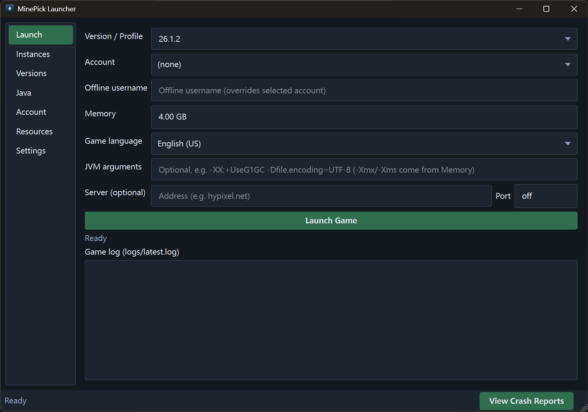
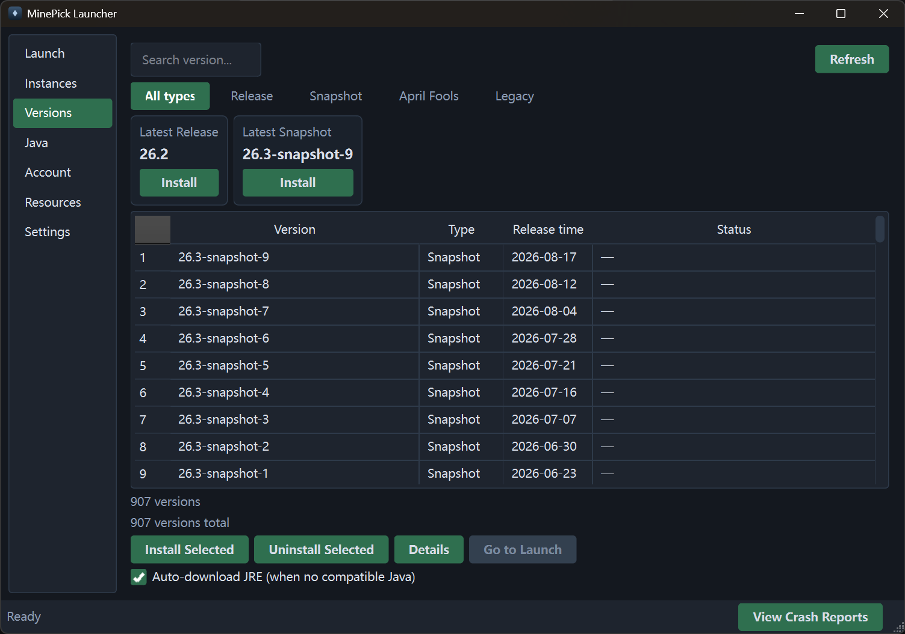
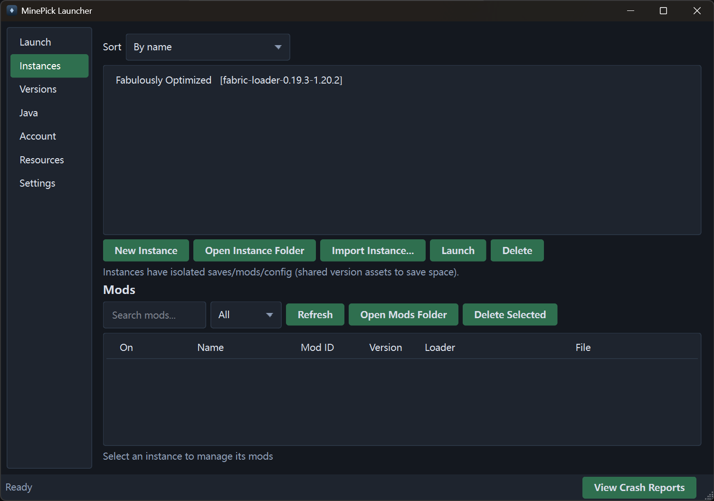
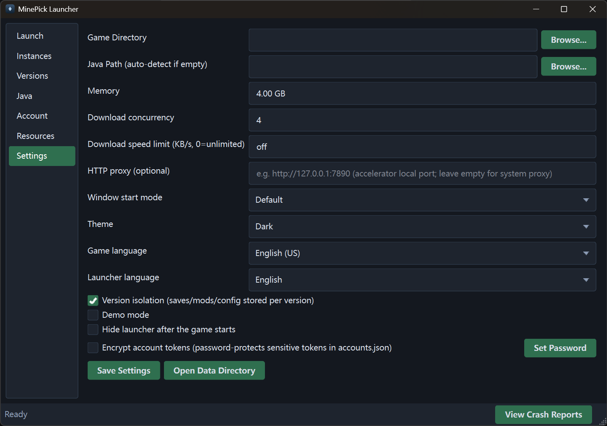

[English](README.md) | [简体中文](README_zh.md)

# MinePick Launcher

An open-source Minecraft launcher built with Python + PySide6: online/offline login, version management, Modrinth mods & modpacks, Fabric/Forge/NeoForge loaders, and instance management — packaged as a portable single-file EXE.

> License: **GPL-3.0** (see LICENSE). Release guide: docs/github_release.md.

## Features

### Accounts
- Microsoft login via device code flow (authorization page auto-opens and the code is copied to your clipboard)
- Multi-account management with one-click switching, skin avatars, automatic token refresh
- Optional encrypted token storage (password-protected)

### Versions & Java
- Version page with category tabs (All / Release / Snapshot / April Fools / Legacy), the complete official version list, "Latest Release" & "Latest Snapshot" cards with one-click install, and a search box
- Version details / one-click install & uninstall
- Automatic Java matching and download (Adoptium JRE with SHA256 verification), built-in Java manager
- Version isolation: separate saves/mods/config per version

### Launching
- Memory, game language, custom JVM arguments, direct server connect, demo mode
- Live game log tail and a crash-report viewer
- Auto-hide the launcher after the game starts (the game keeps running independently)

### Resources (Modrinth & CurseForge)
- Switchable content source: Modrinth / CurseForge (top-30 popular showcase, keyword search, download counts)
- Mod search & install (keyword search, download counts, version/loader selection)
- One-click modpack install (auto loader setup → instance creation → all files + overrides merged)
- Resource packs / shaders, installed-content manager (list / size / delete)
- CurseForge API key is bundled with the build; users can supply their own key in Settings

### Loaders & Instances
- Silent Fabric / Forge / NeoForge official installer support
- Instances: create / launch / delete / rename / notes / sorting / import & export
- Per-instance local mod manager: reads mod name / ID / version / loader from jar metadata (Fabric / Quilt / NeoForge / Forge / mcmod.info), one-click enable/disable, search & status filter, drag-and-drop .jar install, batch delete

### UI & UX
- 9 UI languages: 简体中文 / 繁體中文 / English / 日本語 / 한국어 / Русский / Français / Español / Deutsch — auto-selected from the system locale on first run, instant switch
- Dark / light themes
- First-run wizard (language / game directory / memory)
- Download speed limit, resumable downloads, live speed & ETA

## Screenshots

<div align="center">
<table>
  <tr>
    <td></td>
    <td></td>
  </tr>
  <tr>
    <td align="center"><sub>Launch</sub></td>
    <td align="center"><sub>Versions</sub></td>
  </tr>
  <tr>
    <td></td>
    <td></td>
  </tr>
  <tr>
    <td align="center"><sub>Instances & local mod manager</sub></td>
    <td align="center"><sub>Settings</sub></td>
  </tr>
</table>
</div>

## Download & Usage

Get the binaries from the Releases page:
- `MinePick_Launcher.exe` — GUI (double-click to run, no console window)
- `MinePick_Launcher_cli.exe` — CLI (run all commands from a terminal)

Portable mode: a `config/` folder is created next to the EXE on first run; both builds can share it.

CLI examples:
```powershell
MinePick_Launcher_cli.exe login            # Microsoft login
MinePick_Launcher_cli.exe install 1.20.1   # install a version
MinePick_Launcher_cli.exe launch 1.20.1    # launch the game
MinePick_Launcher_cli.exe --help           # list all commands
```

> Note: the EXEs are signed with a self-signed certificate (WDNDXLTX), so SmartScreen on other machines may show "Unknown publisher" — click "More info → Run anyway".

## Development

```powershell
pip install -r requirements-dev.txt
python -m gui                # run the GUI
python -m launcher --help    # run the CLI
pytest -q                    # tests (180+)
ruff check launcher gui tests
```

Build & sign: `pyinstaller build_exe.spec` → `scripts/sign_exe.ps1` (see docs/code_signing.md).

## Related Projects

- [MinePick Launcher Revision](https://github.com/TheDarkLord234/mcl) — a revised edition of MinePick Launcher by a fellow community member

## License

GPL-3.0, see LICENSE.
