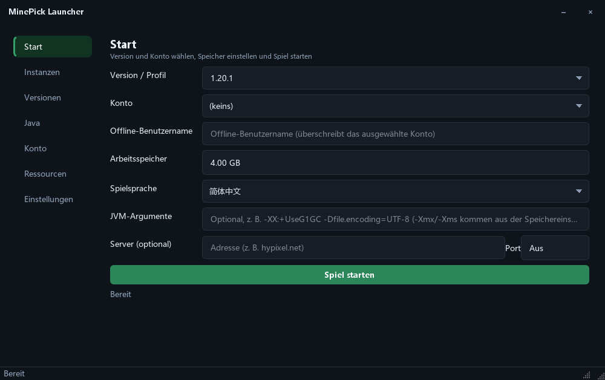
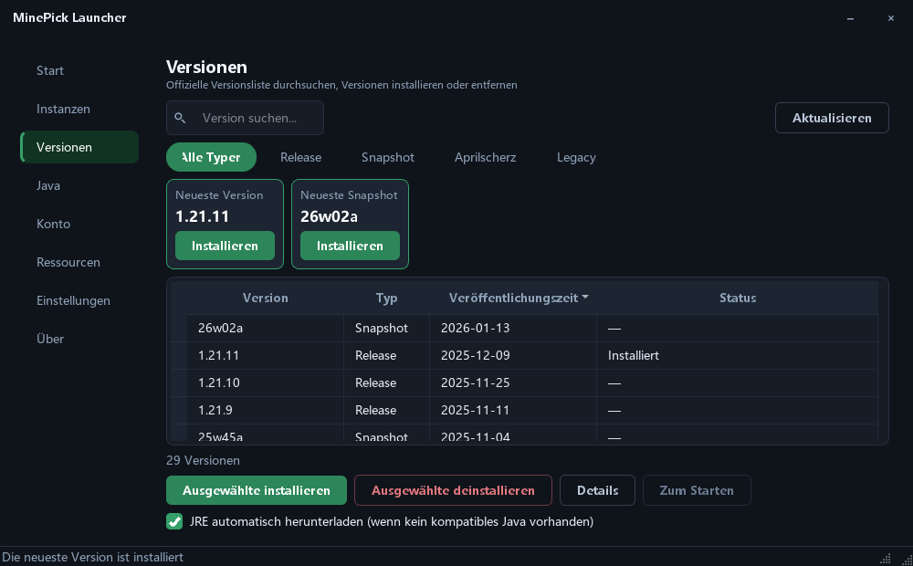
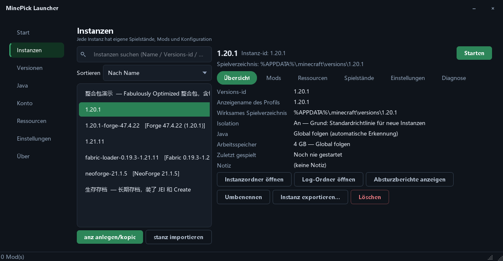
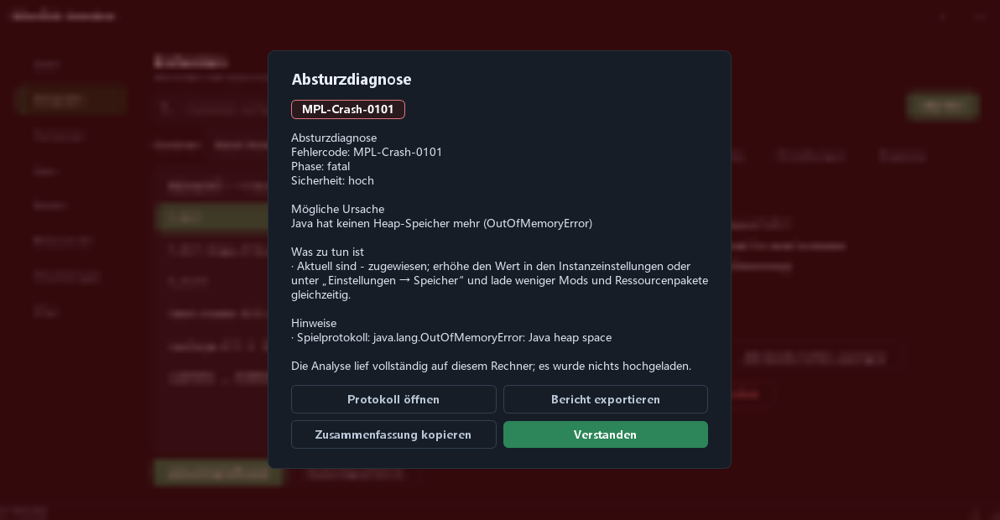

[English](README.md) | [简体中文](README_zh.md) | [繁體中文](README_zh_TW.md) | [日本語](README_ja.md) | [한국어](README_ko.md) | [Русский](README_ru.md) | [Français](README_fr.md) | [Español](README_es.md) | **Deutsch**

# MinePick Launcher

Ein portabler Minecraft-Launcher auf Basis von Python + PySide6: Microsoft-/Offline-Konten, Versionsinstallation,
Modrinth- & CurseForge-Ressourcen, Fabric/Forge/NeoForge/Quilt-Loader, isolierte Instanzen — verpackt als
einzelne portable EXE.

**Aktuelle Version: 0.3.0** — nur ein GUI-Build: eine Befehlszeilen-EXE enthält dieses Repository nicht.

## Screenshots

<table>
  <tr>
    <td></td>
    <td></td>
  </tr>
  <tr>
    <td align="center"><sub>Start</sub></td>
    <td align="center"><sub>Versionen</sub></td>
  </tr>
  <tr>
    <td></td>
    <td></td>
  </tr>
  <tr>
    <td align="center"><sub>Instanzen &amp; lokaler Mod-Manager</sub></td>
    <td align="center"><sub>Einstellungen (Anpassung der Oberfläche)</sub></td>
  </tr>
  <tr>
    <td colspan="2"></td>
  </tr>
  <tr>
    <td colspan="2" align="center"><sub>Absturzdiagnose, über einem weichgezeichneten Hintergrund</sub></td>
  </tr>
</table>

## Oberfläche

- **Assistent beim ersten Start, im Fenster** — der Willkommensablauf ist ein Overlay im Hauptfenster
  (Schrittleiste links, Inhalt rechts, Aktionsleiste unten) statt eines separaten Dialogs und
  schließt sich beim Abschluss, woraufhin das Hauptfenster erscheint
- **Eigener Fensterrahmen** — die Titelleiste wird vom Launcher selbst gezeichnet, sodass die
  Fensterdekoration zum Design passt; sie zeigt kein Symbol, nur den Fenstertitel links und zwei Schaltflächen
  rechts (Minimieren, Schließen); das Spitzhacken-Symbol wird für Taskleiste, Dateisymbol und Dialoge verwendet
- **Anpassbares Aussehen** — Akzentfarbe (beliebiger Hex-Wert, acht Voreinstellungen oder die
  System-Farbauswahl), Schriftart der Oberfläche (alle installierten Familien, die häufigsten oben angeheftet, Tippen
  zum Filtern), Eckenradius (Kompakt / Standard / Rund), Design (Dunkel / Hell / der Systemeinstellung folgen)
- **Klareres Layout** — ein Seitenkopf mit einzeiliger Beschreibung auf jeder Seite, eine gemeinsame
  Abstandsskala auf allen Seiten, Lupensymbole in Suchfeldern
- **Ruhigeres Verhalten** — Scrollbalken erscheinen nur, solange der Zeiger in einer Liste ist; eine
  Fokusumrandung wird nur bei Tastaturnavigation angezeigt; kurzes Einblenden beim Seitenwechsel;
  Spaltenbreiten von Tabellen werden gemerkt; Kopfzeilen lassen sich per Klick sortieren
- **Klar lesbare Zustände** — Schaltflächen sind abgestuft (primär / sekundär / gefährlich mit Umrandung),
  Statusmeldungen sind nach Schweregrad eingefärbt, leere Listen erklären die nächsten Schritte
- **Standardmäßig barrierefrei** — jedes Text-/Hintergrund-Paar erfüllt den WCAG-AA-Kontrast (Akzentflächen
  mit weißer Schrift werden automatisch abgedunkelt), und die Oberfläche ist in 9 Sprachen verfügbar

## Launcher-Funktionen

### Konten
- Microsoft-Anmeldung per Gerätecode-Ablauf (die Autorisierungsseite öffnet sich automatisch und der Code
  wird in die Zwischenablage kopiert), mit Live-Status der Abfrage
- Offline-Modus, Liste mehrerer Konten mit Ein-Klick-Wechsel, Skin-Avatare, automatische Token-Aktualisierung
- Optionale Token-Verschlüsselung (cryptography Fernet + Passwort, `MCLAUNCHER_TOKEN_PASSWORD` wird unterstützt)

### Versionen & Java
- Offizielles Versions-Manifest mit Kategorie-Tabs (Release / Snapshot / Aprilscherz / Legacy), Karten „Neueste
  Version“ und „Neuester Snapshot“, Namenssuche, Ein-Klick-Installation & -Deinstallation, Versionsdetails
- Isolation wird pro Instanz entschieden — immer isoliert, nie, oder der Richtlinie für neue Instanzen
  folgen (eine Instanz, die bereits Mods oder Spielstände enthält, behält automatisch ihren eigenen Ordner)
- Java-Anforderungszuordnung (1.16.5→8, 1.17–1.20.4→17, 1.20.5–1.21.11→21, 26.1+→25) mit automatischem
  Adoptium-Download und Runtime-Manager

### Start & Instanzen
- Speicherempfehlung anhand Mod-Anzahl und verfügbarem RAM, eigene JVM-Argumente, Server-Direktverbindung,
  Spielsprache, Verhalten „Nach dem Spielstart“, Freigabe des Launcher-Arbeitsspeichers
- Instanzen sind Versionsordner: jede installierte Version *ist* eine Instanz, es wird also nichts
  dupliziert und nichts muss zuerst angelegt werden. Jede behält ihre eigenen Spielstände / Mods /
  Konfiguration und ihre eigenen Abweichungen für Isolation, Java, Speicher, JVM-Argumente und
  zusätzliche Spielargumente — all das kann dem globalen Wert folgen oder mit einer Aktion zurückgesetzt werden
- Die Instanzenseite ist eine Liste plus eine Detailansicht mit Tabs für Übersicht, Mods, Ressourcen,
  Spielstände, Einstellungen und Diagnose; Instanzen tragen Notizen, lassen sich umbenennen, exportieren
  und importieren, und der lokale Mod-Manager liest jar-Metadaten (Fabric / Quilt / NeoForge / Forge /
  mcmod.info) mit Aktivieren/Deaktivieren, Suchen & Filtern und Drag-and-Drop

### Absturz- & Startdiagnose
- Wenn ein Start fehlschlägt oder das Spiel ungewöhnlich beendet wird, liest der Launcher das Spiel-Log,
  die Absturzberichte, eine etwaige `hs_err`-Datei und die Ausgabe des gerade überwachten Laufs, gleicht
  sie mit einer eingebauten Wissensdatenbank ab und erklärt **was wahrscheinlich passiert ist, warum und
  was dagegen zu tun ist** — mit stabilem Fehlercode (`MPL-Launch-####` für Fehler auf Launcher-Seite,
  `MPL-Crash-####` für Abstürze auf Spiel-Seite)
- Die Erklärung erscheint in einem Dialog über einem weichgezeichneten Hintergrund und kann als Bericht
  exportiert (Zugriffstoken und Benutzerpfade werden maskiert) oder als Code plus Zusammenfassung kopiert
  werden; die automatische Analyse und die Weichzeichnung lassen sich jeweils abschalten, und jede
  Diagnose wird pro Instanz aufgezeichnet. Die Analyse erfolgt lokal — nichts wird hochgeladen

### Ressourcen
- Mods, Ressourcenpakete, Shader und Modpacks von **Modrinth** und **CurseForge**, pro Tab die Top 30 nach
  Downloads, Stichwortsuche, Ein-Klick-Installation, `.mrpack`-Modpack-Installation

### Über & Updates
- Eine Seite **„Über“**: installierte Version, Link zum Quellcode, Lizenz und rechtliche Hinweise,
  Danksagungen an Dritte sowie eine Update-Prüfung, die den Stand mit dem neuesten GitHub-Release vergleicht
- **Vier Modi für automatische Updates**: herunterladen und installieren, herunterladen und benachrichtigen
  (Standard), nur benachrichtigen oder nicht automatisch prüfen; ist keine Installation möglich, wird die
  Release-Seite geöffnet

## Download & Verwendung

Laden Sie `MinePick_Launcher.exe` von der Releases-Seite herunter und doppelklicken Sie darauf — kein Installer,
kein Konsolenfenster. Beim ersten Start wird neben der EXE ein Ordner `config/` angelegt, sodass Einstellungen,
Konten und Instanzen in einem einzigen Ordner bleiben.

Alles wird in der App konfiguriert: **Änderungen wirken sofort, es gibt keinen Speichern-Button.**

> Der Build ist mit einem selbstsignierten Zertifikat (WDNDXLTX) signiert, daher kann SmartScreen auf anderen
> Rechnern vor einem unbekannten Herausgeber warnen — wählen Sie „Weitere Informationen → Trotzdem ausführen“.

## Entwicklung

```powershell
pip install -r requirements-dev.txt
python -m gui                # run the GUI
pytest -q                    # tests
ruff check launcher gui tests
```

Build & Signieren: `pyinstaller build_exe.spec` → `scripts/sign_exe.ps1` (siehe `docs/code_signing_en.md`).
Die Spec-Datei erzeugt eine einzelne GUI-EXE (die Build-Voraussetzungen stehen in `docs/github_release_en.md`).

Oberflächenprüfung mit einem Befehl (Tests + Lint + Kontrast/Überlauf/Hoch-DPI + Eckenradius-Audit + Screenshots):

```powershell
python tools/ui_regression.py            # add --quick to skip the screenshots
```

Design-Interna (Platzhalter, Anpassungs-Hooks, neue Option hinzufügen): `docs/theming_en.md`.

## Lizenz

GPL-3.0-only — siehe [LICENSE](LICENSE). Das mit jeder Veröffentlichung ausgelieferte Quellcode-Paket (`Source_code.zip`)
erfüllt die Anforderung der GPL zur Quellcode-Verteilung.

## Verwandte Projekte

- [MinePick Launcher Classic](https://github.com/xltxdocs/MinePick_Launcher_Classic) — der archivierte Vorgänger dieses Projekts (GUI + CLI)
- [MinePick Launcher Revision](https://github.com/TheDarkLord234/MinePick_Launcher_Revision) — eine überarbeitete Edition von einem Mitglied der Community