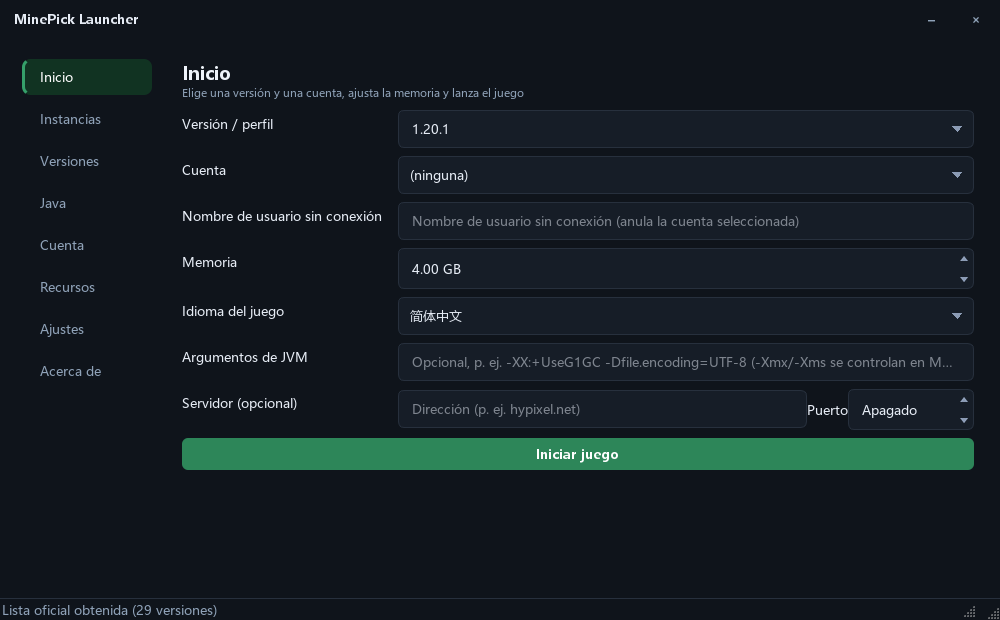
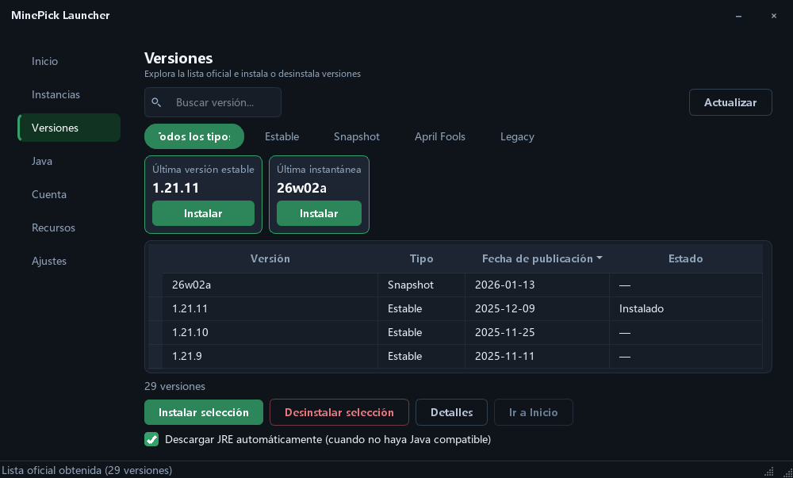
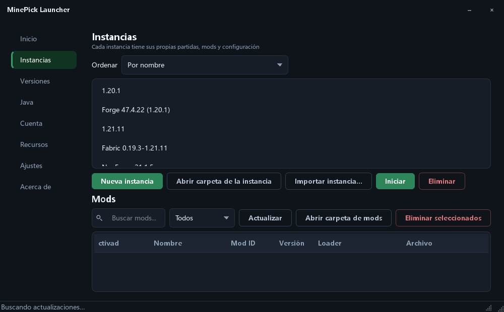
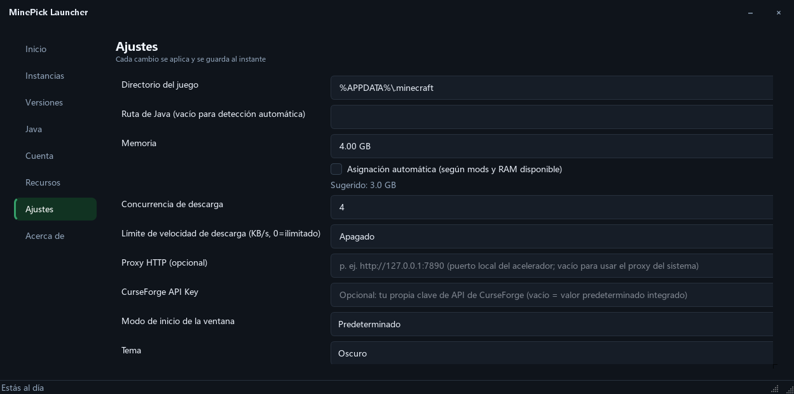

[English](README.md) | [简体中文](README_zh.md) | [繁體中文](README_zh_TW.md) | [日本語](README_ja.md) | [한국어](README_ko.md) | [Русский](README_ru.md) | [Français](README_fr.md) | **Español** | [Deutsch](README_de.md)

# MinePick Launcher

Un launcher portátil de Minecraft creado con Python + PySide6: cuentas de Microsoft/sin conexión, instalación de versiones,
recursos de Modrinth y CurseForge, cargadores Fabric/Forge/NeoForge/Quilt, instancias aisladas — empaquetado como un
único EXE portátil.

**Versión actual: 0.2.0** — solo compilación con GUI: este repositorio no incluye ningún ejecutable de CLI.

## Capturas de pantalla

<table>
  <tr>
    <td></td>
    <td></td>
  </tr>
  <tr>
    <td align="center"><sub>Inicio</sub></td>
    <td align="center"><sub>Versiones</sub></td>
  </tr>
  <tr>
    <td></td>
    <td></td>
  </tr>
  <tr>
    <td align="center"><sub>Instancias &amp; gestor de mods local</sub></td>
    <td align="center"><sub>Ajustes (personalización de la interfaz)</sub></td>
  </tr>
</table>

## Interfaz

- **Asistente de primer inicio, dentro de la ventana** — el flujo de bienvenida es una capa superpuesta dentro de la
  ventana principal (barra de pasos a la izquierda, contenido a la derecha, barra de acciones abajo) en lugar de un
  diálogo aparte, y al terminar se cierra y da paso a la ventana principal
- **Marco de ventana personalizado** — la barra de título la dibuja el propio launcher, así que el marco combina con
  el tema; no muestra ningún icono: solo el texto del título a la izquierda y dos botones a la derecha (minimizar,
  cerrar); el icono de pico se usa para la barra de tareas, el archivo y los diálogos
- **Aspecto personalizable** — color de acento (cualquier valor hexadecimal, ocho preajustes o el selector de color
  del sistema), fuente de la interfaz (todas las familias instaladas, las comunes fijadas arriba, filtrado al escribir),
  redondeo de esquinas (compacto / predeterminado / redondeado), tema (oscuro / claro / seguir el sistema)
- **Diseño más claro** — un encabezado de página con una descripción de una línea en cada página, una única escala de
  espaciado en todas las páginas, iconos de lupa en los campos de búsqueda
- **Interacción más discreta** — las barras de desplazamiento solo aparecen mientras el puntero está dentro de una lista,
  el contorno de foco se muestra solo para la navegación con teclado, un breve fundido al cambiar de página, se recuerda
  el ancho de las columnas de las tablas, un clic en una cabecera ordena la columna
- **Estados legibles de un vistazo** — los botones tienen jerarquía (principal / secundario / peligro con contorno), los
  mensajes de estado se colorean según su gravedad, las listas vacías explican qué hacer a continuación
- **Accesible por defecto** — cada combinación de texto y fondo cumple el contraste WCAG AA (los rellenos
  de acento con texto blanco se oscurecen automáticamente) y la interfaz está disponible en 9 idiomas

## Funciones del launcher

### Cuentas
- Inicio de sesión de Microsoft mediante flujo de código de dispositivo (la página de autorización se abre
  automáticamente y el código se copia al portapapeles), con estado de sondeo en tiempo real
- Modo sin conexión, lista de varias cuentas con cambio en un clic, avatares de skin, renovación automática de tokens
- Cifrado opcional de tokens (cryptography Fernet + contraseña, con soporte de `MCLAUNCHER_TOKEN_PASSWORD`)

### Versiones y Java
- Lista oficial de versiones con pestañas por categoría (estable / snapshot / día de los inocentes / heredadas), tarjetas
  «Última versión estable» y «Última snapshot», búsqueda por nombre, instalación y desinstalación en un clic,
  detalles de la versión
- Aislamiento de versiones: cada versión conserva sus propios guardados / mods / configuración
- Correspondencia de requisitos de Java (1.16.5→8, 1.17–1.20.4→17, 1.20.5–1.21.11→21, 26.1+→25) con descarga automática
  desde Adoptium y un gestor de runtimes

### Inicio e instancias
- Sugerencia de memoria según el número de mods y la RAM libre, argumentos de JVM personalizados, conexión directa a
  servidores, idioma del juego, comportamiento «tras iniciar el juego», liberación de la memoria del launcher
- Instancias aisladas con notas, renombrado, importación/exportación y un gestor de mods local por instancia (lee los
  metadatos del jar de Fabric / Quilt / NeoForge / Forge / mcmod.info, activar/desactivar, búsqueda y filtro, arrastrar y soltar)

### Recursos
- Mods, paquetes de recursos, shaders y modpacks de **Modrinth** y **CurseForge**, top 30 por descargas en cada pestaña,
  búsqueda por palabra clave, instalación en un clic, instalación de
  modpacks `.mrpack`

### Acerca de y actualizaciones
- Una página **Acerca de**: versión instalada, enlace al código fuente, licencia y avisos legales,
  agradecimientos a terceros y una comprobación que compara la versión instalada con la última release de GitHub
- **Cuatro modos de actualización automática**: descargar e instalar, descargar y avisar (predeterminado),
  avisar solamente o no comprobar automáticamente; si no se puede instalar, se abre la página de la release

## Descarga y uso

Descarga `MinePick_Launcher.exe` desde la página de Releases y haz doble clic: sin instalador y sin ventana de consola.
En el primer inicio se crea una carpeta `config/` junto al EXE, de modo que los ajustes, las cuentas y las instancias
se quedan en una sola carpeta.

Todo se configura dentro de la aplicación: **los ajustes se aplican al instante, no hay botón de guardar.**

> Esta compilación está firmada con un certificado autofirmado (WDNDXLTX), por lo que SmartScreen en otros equipos puede
> avisar de un editor desconocido: elige «Más información → Ejecutar de todos modos».

## Desarrollo

```powershell
pip install -r requirements-dev.txt
python -m gui                # run the GUI
pytest -q                    # tests
ruff check launcher gui tests
```

Compilar y firmar: `pyinstaller build_exe.spec` → `scripts/sign_exe.ps1` (ver `docs/code_signing_en.md`).
El archivo spec genera un único EXE con GUI (los requisitos previos de compilación se indican en `docs/github_release_en.md`).

Comprobación de la interfaz con un solo comando (pruebas + lint + contraste/desbordamiento/alta DPI + auditoría de
esquinas + capturas):

```powershell
python tools/ui_regression.py            # add --quick to skip the screenshots
```

Funcionamiento interno de los temas (marcadores de posición, puntos de extensión para la personalización, cómo
añadir una nueva opción): `docs/theming_en.md`.

## Licencia

GPL-3.0-only — ver [LICENSE](LICENSE). El paquete de código fuente incluido con cada versión (`Source_code.zip`)
cumple el requisito de distribución del código fuente de la GPL.

## Proyectos relacionados

- [MinePick Launcher Classic](https://github.com/xltxdocs/MinePick_Launcher_Classic) — el predecesor archivado de este proyecto (GUI + CLI)
- [MinePick Launcher Revision](https://github.com/TheDarkLord234/MinePick_Launcher_Revision) — una edición revisada por un miembro de la comunidad