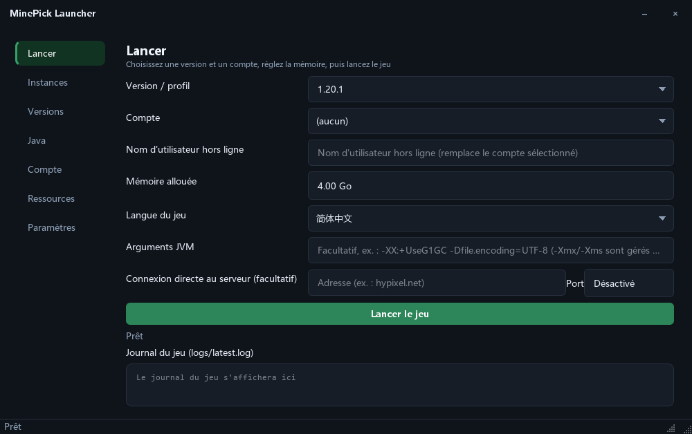
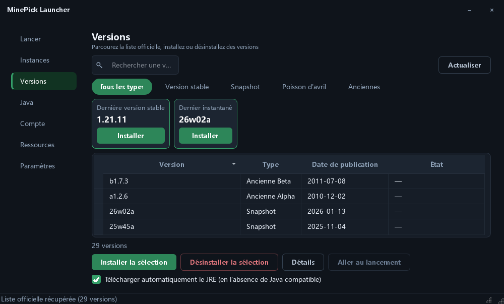
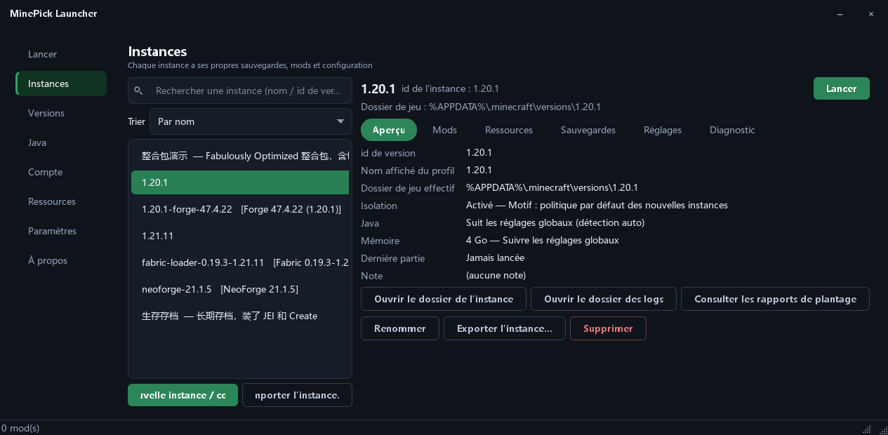
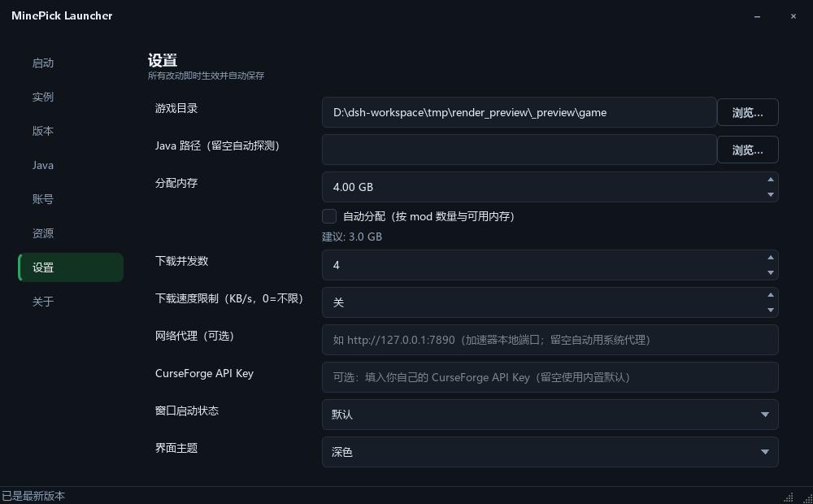
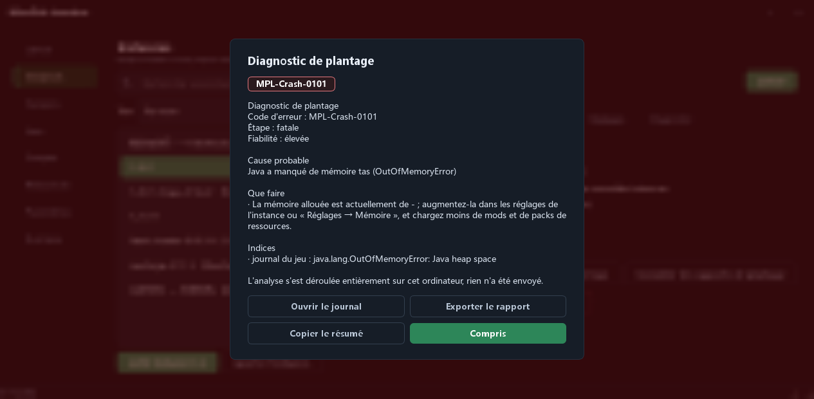

[English](README.md) | [简体中文](README_zh.md) | [繁體中文](README_zh_TW.md) | [日本語](README_ja.md) | [한국어](README_ko.md) | [Русский](README_ru.md) | **Français** | [Español](README_es.md) | [Deutsch](README_de.md)

# MinePick Launcher

Un lanceur Minecraft portable écrit en Python + PySide6 : comptes Microsoft/hors ligne, installation de versions,
ressources Modrinth et CurseForge, chargeurs Fabric/Forge/NeoForge/Quilt, instances isolées — le tout empaqueté
dans un seul EXE portable.

**Version actuelle : 0.3.1** — version GUI uniquement : ce dépôt ne contient aucun exécutable CLI.

## Captures d'écran

<table>
  <tr>
    <td></td>
    <td></td>
  </tr>
  <tr>
    <td align="center"><sub>Lancement</sub></td>
    <td align="center"><sub>Versions</sub></td>
  </tr>
  <tr>
    <td></td>
    <td></td>
  </tr>
  <tr>
    <td align="center"><sub>Instances et gestionnaire de mods local</sub></td>
    <td align="center"><sub>Paramètres (personnalisation de l'interface)</sub></td>
  </tr>
  <tr>
    <td colspan="2"></td>
  </tr>
  <tr>
    <td colspan="2" align="center"><sub>Diagnostic de plantage, sur un arrière-plan flouté</sub></td>
  </tr>
</table>

## Interface

- **Assistant de premier démarrage, dans la fenêtre** — le flux d'accueil est une surcouche à l'intérieur de la
  fenêtre principale (colonne des étapes à gauche, contenu à droite, barre d'actions en bas) au lieu d'une boîte de
  dialogue séparée, et il se ferme à la fin en rendant la main à la fenêtre principale
- **Cadre de fenêtre personnalisé** — la barre de titre est dessinée par le lanceur lui-même, l'habillage suit
  donc le thème ; elle n'affiche aucune icône : seulement le texte du titre à gauche et deux boutons à droite
  (réduire, fermer) ; l'icône de pioche est utilisée pour la barre des tâches, l'icône de fichier et les dialogues
- **Apparence personnalisable** — couleur d'accent (n'importe quelle valeur hexadécimale, huit préréglages ou le
  sélecteur de couleur du système), police de l'interface (toutes les familles installées, les plus courantes
  épinglées, filtrage à la saisie), arrondi des coins (compact / par défaut / arrondi), thème (sombre / clair /
  suivre le système)
- **Mise en page plus claire** — un en-tête de page avec une description en une ligne sur chaque page, une seule
  échelle d'espacement sur toutes les pages, des icônes de loupe dans les champs de recherche
- **Interactions plus sobres** — les barres de défilement n'apparaissent que lorsque le pointeur est dans une
  liste, le contour de focus n'est affiché que pour la navigation au clavier, un court fondu au changement de page,
  la largeur des colonnes des tableaux est mémorisée, un clic sur un en-tête trie la colonne
- **États lisibles d'un coup d'œil** — les boutons sont hiérarchisés (principal / secondaire / danger en contour), les
  messages d'état sont colorés selon leur gravité, les listes vides expliquent quoi faire ensuite
- **Accessible par défaut** — chaque combinaison texte/fond respecte le contraste WCAG AA (les aplats d'accent
  portant du texte blanc sont assombris automatiquement), et l'interface est disponible en 9 langues

## Fonctionnalités du lanceur

### Comptes
- Connexion Microsoft via le flux de code d'appareil (la page d'autorisation s'ouvre automatiquement et le code
  est copié dans le presse-papiers), avec un état d'interrogation en direct
- Mode hors ligne, liste multi-comptes avec bascule en un clic, avatars de skin, actualisation automatique des jetons
- Chiffrement facultatif des jetons (cryptography Fernet + mot de passe, `MCLAUNCHER_TOKEN_PASSWORD` pris en charge)

### Versions et Java
- Manifeste officiel des versions avec onglets par catégorie (version stable / snapshot / poisson d'avril /
  anciennes), cartes « Dernière version stable » et « Dernier snapshot », recherche par nom, installation et
  désinstallation en un clic, détails de version
- L'isolation se décide instance par instance — soit toujours isolée, soit jamais, soit selon la politique
  des nouvelles instances (une instance qui contient déjà des mods ou des sauvegardes conserve
  automatiquement son propre dossier)
- Correspondance des exigences Java (1.16.5→8, 1.17–1.20.4→17, 1.20.5–1.21.11→21, 26.1+→25) avec téléchargement
  automatique depuis Adoptium et un gestionnaire de runtimes

### Lancement et instances
- Suggestion de mémoire selon le nombre de mods et la RAM disponible, arguments JVM personnalisés, connexion
  directe au serveur, langue du jeu, comportement « après le lancement du jeu »,
  libération de la mémoire du lanceur
- Les instances sont des dossiers de version : chaque version installée *est* une instance, rien n'est donc
  dupliqué et rien n'a besoin d'être créé au préalable. Chacune conserve ses propres sauvegardes / mods /
  configuration, ainsi que ses propres réglages pour l'isolation, Java, la mémoire, les arguments JVM et
  les arguments de jeu supplémentaires — chacun pouvant suivre la valeur globale ou être réinitialisé en
  une seule action
- La page des instances est une liste, avec une vue détaillée comportant des onglets aperçu, mods,
  ressources, sauvegardes, réglages et diagnostic ; les instances acceptent des notes, peuvent être
  renommées, exportées et importées, et le gestionnaire de mods local lit les métadonnées des fichiers jar
  (Fabric / Quilt / NeoForge / Forge / mcmod.info) avec activation/désactivation, recherche, filtrage et
  glisser-déposer

### Diagnostic de plantage et de lancement
- Lorsqu'un lancement échoue ou que le jeu se termine anormalement, le lanceur lit le journal du jeu, les
  rapports de plantage, un éventuel fichier `hs_err` et la sortie de l'exécution qu'il vient d'observer, les
  confronte à une base de connaissances intégrée et explique **ce qui s'est probablement passé, pourquoi et
  que faire**, avec un code d'erreur stable (`MPL-Launch-####` pour les échecs côté lanceur,
  `MPL-Crash-####` pour les plantages côté jeu)
- L'explication s'affiche dans une fenêtre par-dessus un arrière-plan flouté et peut être exportée sous
  forme de rapport (jetons d'accès et chemins utilisateur masqués) ou copiée sous forme de code d'erreur et
  de résumé ; l'analyse automatique et le flou peuvent être désactivés indépendamment, et chaque diagnostic
  est enregistré pour l'instance concernée. L'analyse est locale — rien n'est envoyé

### Ressources
- Mods, packs de ressources, shaders et modpacks depuis **Modrinth** et **CurseForge**, top 30 des plus téléchargés
  par onglet, recherche par mot-clé, installation en un clic, installation de
  modpacks `.mrpack`

### À propos et mises à jour
- Une page **À propos** : version installée, lien vers le code source, licence et mentions légales,
  remerciements aux tiers, et une vérification des mises à jour comparant la version installée à la
  dernière release GitHub
- **Quatre modes de mise à jour automatique** : télécharger et installer, télécharger et notifier (par défaut),
  notifier seulement, ou ne pas vérifier automatiquement ; si l'installation est impossible, le lanceur ouvre
  la page de la release

## Téléchargement et utilisation

Téléchargez `MinePick_Launcher.exe` depuis la page Releases et double-cliquez dessus — pas d'installateur, pas de
fenêtre de console. Au premier lancement, un dossier `config/` est créé à côté de l'EXE : les paramètres, les
comptes et les instances restent ainsi dans un seul dossier.

Tout se configure dans l'application : **les paramètres s'appliquent immédiatement, il n'y a pas de bouton
Enregistrer.**

> La version est signée avec un certificat auto-signé (WDNDXLTX), SmartScreen peut donc, sur d'autres machines,
> signaler un éditeur inconnu — choisissez « Plus d'informations → Exécuter quand même ».

## Développement

```powershell
pip install -r requirements-dev.txt
python -m gui                # run the GUI
pytest -q                    # tests
ruff check launcher gui tests
```

Compilation et signature : `pyinstaller build_exe.spec` → `scripts/sign_exe.ps1` (voir `docs/code_signing_en.md`).
Le fichier spec produit un seul EXE en version GUI (les prérequis de compilation sont listés dans
`docs/github_release_en.md`).

Vérification de l'interface en une seule commande (tests + lint + contraste/débordement/haute résolution + audit des
coins + captures d'écran) :

```powershell
python tools/ui_regression.py            # add --quick to skip the screenshots
```

Fonctionnement interne des thèmes (variables de substitution, points d'extension, ajout d'une nouvelle option) :
`docs/theming_en.md`.

## Licence

GPL-3.0-only — voir [LICENSE](LICENSE). Le paquet source fourni avec chaque version (`Source_code.zip`) satisfait
à l'exigence de distribution du code source de la GPL.

## Projets associés

- [MinePick Launcher Classic](https://github.com/xltxdocs/MinePick_Launcher_Classic) — le prédécesseur archivé de ce projet (GUI + CLI)
- [MinePick Launcher Revision](https://github.com/TheDarkLord234/MinePick_Launcher_Revision) — une édition révisée par un membre de la communauté