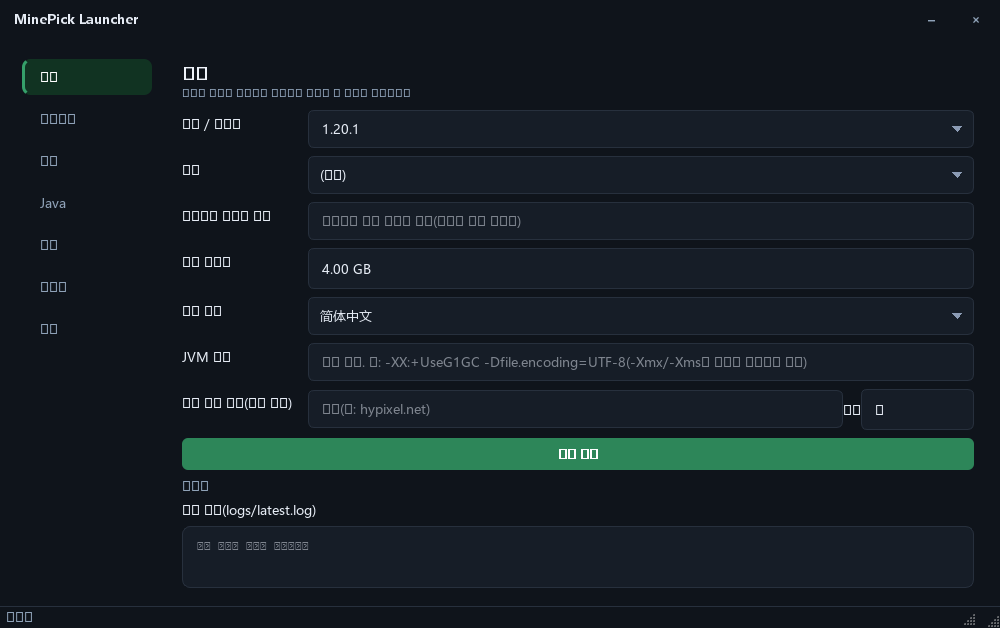
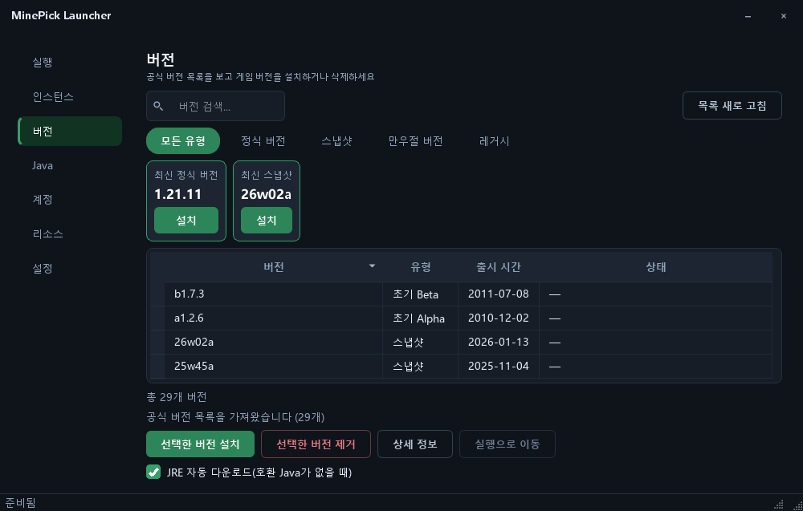
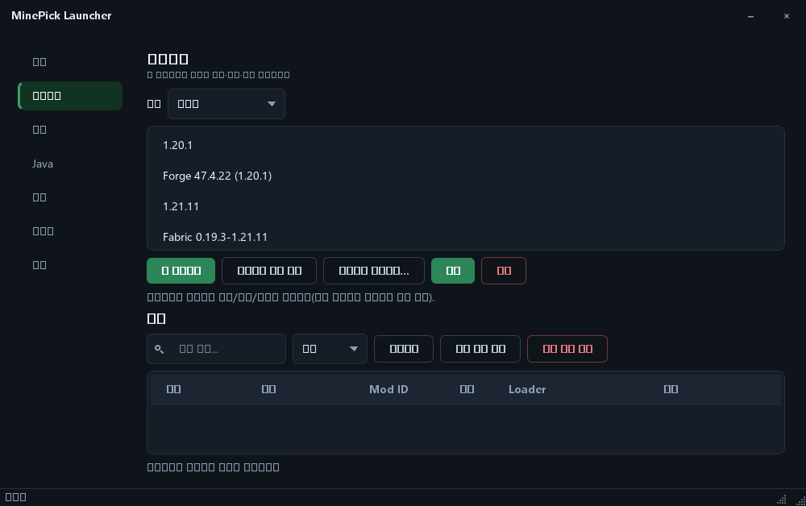
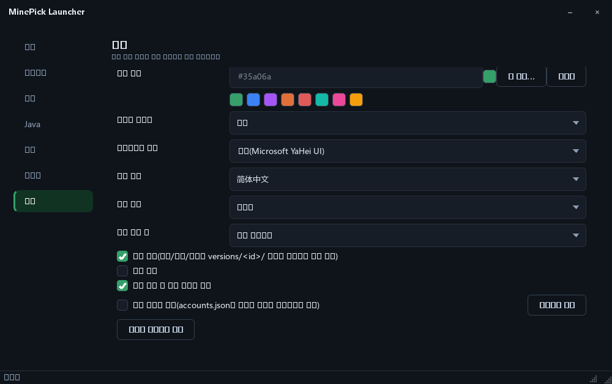

[English](README.md) | [简体中文](README_zh.md) | [繁體中文](README_zh_TW.md) | [日本語](README_ja.md) | **한국어** | [Русский](README_ru.md) | [Français](README_fr.md) | [Español](README_es.md) | [Deutsch](README_de.md)

# MinePick Launcher

Python + PySide6로 만든 포터블 Minecraft 런처: Microsoft/오프라인 계정, 버전 설치,
Modrinth & CurseForge 리소스, Fabric/Forge/NeoForge/Quilt 로더, 격리된 인스턴스 — 단일
포터블 EXE로 패키징되어 있습니다.

**현재 버전 0.3.0** —— GUI 빌드만 제공하며, 이 저장소에는 CLI 실행 파일이 없습니다.

## 스크린샷

<table>
  <tr>
    <td></td>
    <td></td>
  </tr>
  <tr>
    <td align="center"><sub>실행</sub></td>
    <td align="center"><sub>버전</sub></td>
  </tr>
  <tr>
    <td></td>
    <td></td>
  </tr>
  <tr>
    <td align="center"><sub>인스턴스 &amp; 로컬 모드 관리자</sub></td>
    <td align="center"><sub>설정(인터페이스 사용자 지정)</sub></td>
  </tr>
</table>

## 인터페이스

- **창 안에서 진행되는 최초 실행 마법사** — 환영 안내가 별도 대화 상자가 아니라 메인 창 내부의 오버레이
  (왼쪽에 단계 안내, 오른쪽에 콘텐츠, 아래쪽에 동작 표시줄)로 표시되며, 완료하면
  즉시 닫히고 메인 창으로 넘어갑니다(페이드되는 것은 단계 전환뿐입니다)
- **사용자 지정 창 프레임** — 제목 표시줄을 런처가 직접 그리므로 창 테두리가 테마를
  따라갑니다. 제목 표시줄에는 왼쪽의 창 제목과 오른쪽의 최소화·닫기 두 버튼만 있고,
  곡괭이 아이콘은 작업 표시줄, 파일 아이콘, 대화 상자에 사용됩니다
- **사용자 지정 가능한 외형** — 강조 색상(임의의 16진수 값, 8가지 프리셋 또는 시스템 색 선택기),
  인터페이스 글꼴(설치된 모든 글꼴 패밀리, 자주 쓰는 글꼴 고정, 입력하여 필터링), 모서리 둥글기(작게 / 기본 /
  둥글게), 테마(다크 / 라이트 / 시스템 설정 따르기)
- **더 명확해진 레이아웃** — 모든 페이지에 한 줄 설명이 있는 페이지 헤더, 탐색 목록으로
  바로 시작하는 사이드바, 모든 페이지에 통일된 간격 체계, 검색 필드의 돋보기 아이콘
- **조작은 한결 차분하게** — 스크롤 막대는 포인터가 목록 안에 있을 때만 나타나고, 포커스 외곽선은
  키보드 탐색에만 표시되며, 페이지를 전환할 때 짧은 페이드가 적용되고, 표 열 너비가 기억되며,
  헤더를 클릭해 정렬할 수 있습니다
- **상태를 한눈에** — 버튼에 위계가 있고(주요 / 보조 / 외곽선 위험), 상태 메시지는
  심각도에 따라 색이 달라지며, 빈 목록은 다음에 무엇을 해야 할지 알려줍니다
- **기본으로 제공되는 접근성** — 모든 텍스트/배경 조합이 WCAG AA 명도 대비를 충족하며(강조 색상 위
  흰색 글자의 배경은 자동으로 어두워집니다), 인터페이스는 9개 언어로 제공됩니다

## 런처 기능

### 계정
- 장치 코드 플로우를 통한 Microsoft 로그인(인증 페이지가 자동으로 열리고 코드가
  클립보드에 복사됨), 실시간 폴링 상태 표시
- 오프라인 모드, 원클릭 전환이 가능한 다중 계정 목록, 스킨 아바타, 자동 토큰 갱신
- 선택적 토큰 암호화(cryptography Fernet + 비밀번호, `MCLAUNCHER_TOKEN_PASSWORD` 지원)

### 버전 및 Java
- 공식 버전 매니페스트와 분류 탭(정식 버전 / 스냅샷 / 만우절 버전 / 레거시), “최신 정식 버전”
  및 “최신 스냅샷” 카드, 이름 검색, 원클릭 설치 및 제거, 버전 상세 정보
- 버전 격리: 각 버전이 자체 세이브 데이터 / 모드 / 설정을 유지합니다
- Java 요구 사항 매핑(1.16.5→8, 1.17–1.20.4→17, 1.20.5–1.21.11→21, 26.1+→25)과 Adoptium
  자동 다운로드 및 런타임 관리자

### 실행 및 인스턴스
- 모드 수와 사용 가능한 RAM을 기준으로 한 메모리 할당량 추천, 사용자 지정 JVM 인수, 서버 직접 연결, 게임 언어,
  “게임 실행 후” 동작, 런처 메모리 해제(작업 집합 트리밍)
- 메모, 이름 변경, 가져오기/내보내기를 지원하는 격리된 인스턴스와 인스턴스별 로컬 모드 관리자
  (Fabric / Quilt / NeoForge / Forge / mcmod.info의 jar 메타데이터를 읽고, 활성화/비활성화, 검색 및 필터, 드래그 앤 드롭)

### 리소스
- **Modrinth**와 **CurseForge**의 모드, 리소스팩, 셰이더, 모드팩, 탭별 다운로드 수 기준 인기 Top 30,
  키워드 검색, 원클릭 설치, `.mrpack` 모드팩 설치

### 정보 및 업데이트
- **「정보」페이지**: 현재 버전, 소스 코드 링크, 라이선스 및 법적 고지, 서드파티 감사 인사, 그리고 설치된
  버전과 GitHub 최신 릴리스를 비교하는 업데이트 확인
- **자동 업데이트 4단계**: 내려받아 설치 / 내려받고 알림(기본) / 알림만 / 자동 확인 안 함.
  자동 설치가 불가능하면 릴리스 페이지를 여는 동작으로 대체됩니다

## 다운로드 및 사용법

릴리스 페이지에서 `MinePick_Launcher.exe`를 내려받아 더블 클릭하면 됩니다 — 설치 프로그램도, 콘솔 창도
없습니다. 처음 실행하면 EXE 옆에 `config/` 폴더가 생성되므로 설정, 계정, 인스턴스가
한 폴더 안에 유지됩니다.

모든 설정은 앱 안에서 이루어집니다: **설정은 즉시 적용되며 저장 버튼이 없습니다.**

> 이 빌드는 자체 서명 인증서(WDNDXLTX)로 서명되었으므로 다른 컴퓨터의 SmartScreen이
> 알 수 없는 게시자라고 경고할 수 있습니다 — “추가 정보 → 실행”을 선택하세요.

## 개발

```powershell
pip install -r requirements-dev.txt
python -m gui                # run the GUI
pytest -q                    # tests
ruff check launcher gui tests
```

빌드 및 서명: `pyinstaller build_exe.spec` → `scripts/sign_exe.ps1` (`docs/code_signing_en.md` 참고).
이 spec 파일은 단일 GUI EXE를 생성합니다(빌드 사전 요구 사항은 `docs/github_release_en.md`에 나열되어 있습니다).

한 명령으로 끝내는 인터페이스 검사(테스트 + 린트 + 명도 대비/오버플로/고DPI + 모서리 둥글기 검사 + 스크린샷):

```powershell
python tools/ui_regression.py            # add --quick to skip the screenshots
```

테마 내부 구조(플레이스홀더, 사용자 지정 훅, 새 옵션을 추가하는 방법): `docs/theming_en.md`.

## 라이선스

GPL-3.0-only — [LICENSE](LICENSE)를 참고하세요. 각 릴리스에 포함되는 소스 패키지(`Source_code.zip`)가
GPL 소스 배포 요구 사항을 충족합니다.

## 관련 프로젝트

- [MinePick Launcher Classic](https://github.com/xltxdocs/MinePick_Launcher_Classic) — 이 프로젝트의 전신(보관됨, GUI + CLI)
- [MinePick Launcher Revision](https://github.com/TheDarkLord234/MinePick_Launcher_Revision) — 커뮤니티 동료가 만든 개정판