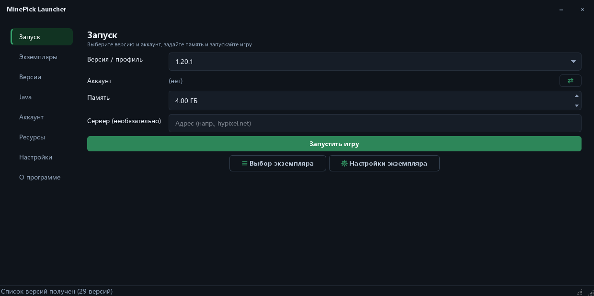
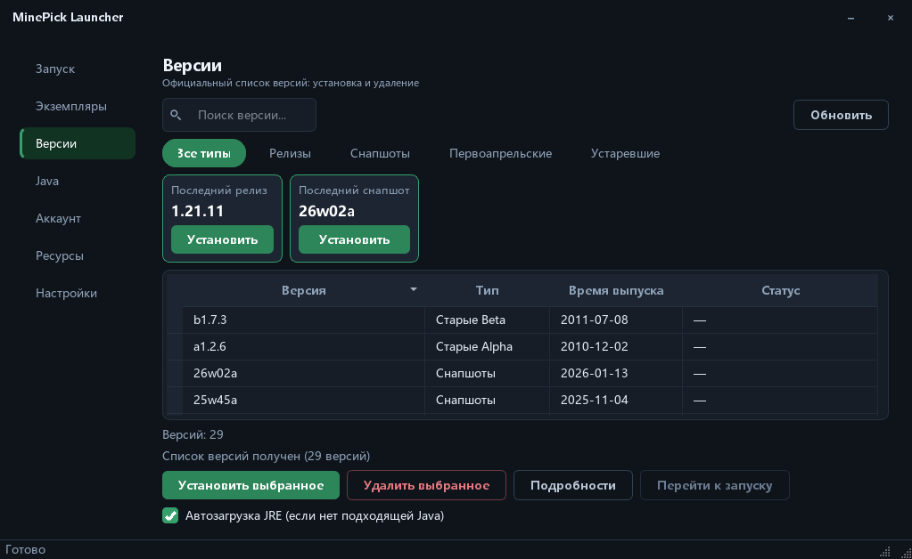
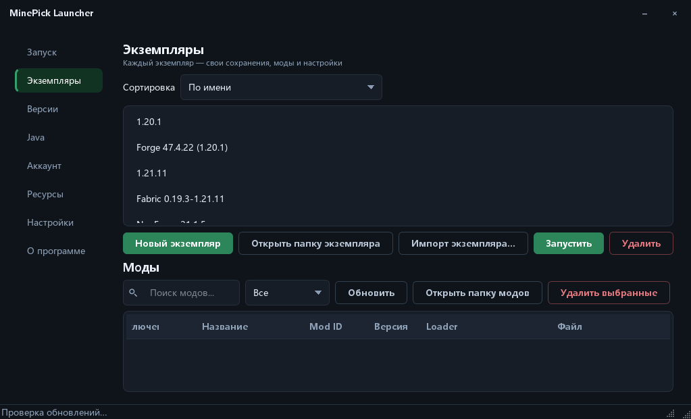

[English](README.md) | [简体中文](README_zh.md) | [繁體中文](README_zh_TW.md) | [日本語](README_ja.md) | [한국어](README_ko.md) | **Русский** | [Français](README_fr.md) | [Español](README_es.md) | [Deutsch](README_de.md)

# MinePick Launcher — UI Trial

Портативный лаунчер Minecraft на Python + PySide6: аккаунты Microsoft и офлайн-режим, установка версий,
ресурсы Modrinth и CurseForge, загрузчики Fabric/Forge/NeoForge/Quilt, изолированные экземпляры — всё
упаковано в один портативный EXE.

**Этот репозиторий — экспериментальная ветка интерфейса (версия 0.1.5).** В нём тот же набор функций
лаунчера, что и в основном проекте, плюс описанная ниже переработка интерфейса, а поставляется он
**только как GUI-сборка** — исполняемого файла CLI здесь нет.

> Основной лаунчер: [xltxdocs/MinePick_Launcher](https://github.com/xltxdocs/MinePick_Launcher)

## Скриншоты

<table>
  <tr>
    <td></td>
    <td></td>
  </tr>
  <tr>
    <td align="center"><sub>Запуск</sub></td>
    <td align="center"><sub>Версии</sub></td>
  </tr>
  <tr>
    <td></td>
    <td></td>
  </tr>
  <tr>
    <td align="center"><sub>Экземпляры и локальный менеджер модов</sub></td>
    <td align="center"><sub>Настройки (персонализация интерфейса)</sub></td>
  </tr>
</table>

## Интерфейс (что меняет эта линия)

- **Мастер первого запуска прямо в окне** — приветственный сценарий показывается оверлеем внутри главного окна
  (слева панель шагов, справа содержимое, снизу панель действий), а не отдельным диалоговым окном;
  по завершении он сразу закрывается и передаёт управление главному окну (затухание только при смене шага)
- **Собственная рамка окна** — строку заголовка рисует сам лаунчер, поэтому оформление совпадает с темой;
  в строке заголовка слева только название окна, а справа две кнопки — свернуть и закрыть;
  значок кирки используется в панели задач, в качестве значка файла и в диалоговых окнах
- **Настраиваемый вид** — акцентный цвет (любое значение HEX, восемь пресетов или системный
  выбор цвета), шрифт интерфейса (все установленные семейства, часто используемые закреплены сверху, фильтрация при вводе),
  скругление углов (компактное / обычное / скруглённое), тема (тёмная / светлая / как в системе)
- **Более понятная вёрстка** — на каждой странице заголовок с описанием в одну строку, боковая панель
  сразу начинается со списка навигации, единая шкала отступов на всех страницах, значки лупы в полях поиска
- **Более спокойное взаимодействие** — полосы прокрутки появляются, только когда указатель находится внутри
  списка, рамка фокуса показывается только при навигации с клавиатуры, короткое затухание при
  переключении страниц, ширины столбцов таблиц запоминаются, сортировка по клику на заголовок
- **Понятные состояния** — кнопки разделены по важности (основная / второстепенная / контурная для опасных действий),
  статусные сообщения окрашены по степени серьёзности, пустые списки подсказывают, что делать дальше
- **Доступность по умолчанию** — каждая пара «текст/фон» соответствует требованиям контраста WCAG AA (заливки с белым
  текстом автоматически затемняются), а интерфейс доступен на 9 языках

## Возможности лаунчера

### Аккаунты
- Вход Microsoft по коду устройства (device code flow; страница авторизации открывается автоматически, а код
  копируется в буфер обмена), статус опроса отображается в реальном времени
- Офлайн-режим, список из нескольких аккаунтов с переключением в один клик, аватары скинов,
  автоматическое обновление токенов
- Необязательное шифрование токенов (cryptography Fernet + пароль, поддерживается `MCLAUNCHER_TOKEN_PASSWORD`)

### Версии и Java
- Официальный список версий с вкладками категорий (релизы / снапшоты / первоапрельские версии / старые (legacy) версии),
  карточки «Последний релиз» и «Последний снапшот», поиск по названию, установка и удаление в один клик,
  сведения о версии
- Изоляция версий: у каждой версии свои сохранения / моды / конфигурация
- Сопоставление требований Java (1.16.5→8, 1.17–1.20.4→17, 1.20.5–1.21.11→21, 26.1+→25) с автоматической
  загрузкой Adoptium и менеджером сред выполнения

### Запуск и экземпляры
- Рекомендация объёма памяти по числу модов и свободной ОЗУ, пользовательские аргументы JVM, прямое подключение
  к серверу, язык игры, журнал в реальном времени, поведение «после запуска игры», освобождение памяти лаунчера
- Изолированные экземпляры с заметками, переименованием, импортом и экспортом, а также локальный
  менеджер модов для каждого экземпляра (читает метаданные jar для Fabric / Quilt / NeoForge / Forge /
  mcmod.info, включение и отключение, поиск и фильтр, перетаскивание)

### Ресурсы
- Моды, ресурс-паки, шейдеры и модпаки из **Modrinth** и **CurseForge**, топ-30 по загрузкам на каждой
  вкладке, поиск по ключевым словам, установка в один клик,
  установка модпаков `.mrpack`

## Загрузка и использование

Скачайте `MinePick_UI_Trial.exe` со страницы Releases и запустите двойным щелчком — установщик не нужен,
окна консоли нет. При первом запуске рядом с EXE создаётся папка `config/`, поэтому настройки, аккаунты
и экземпляры остаются в одной папке.

Всё настраивается прямо в приложении: **изменения применяются сразу, кнопки «Сохранить» нет.**

> Сборка подписана самоподписанным сертификатом (WDNDXLTX), поэтому SmartScreen на других компьютерах
> может предупредить о неизвестном издателе — выберите «Подробнее → Выполнить в любом случае».

## Разработка

```powershell
pip install -r requirements-dev.txt
python -m gui                # run the GUI
pytest -q                    # tests (240+)
ruff check launcher gui tests
```

Сборка и подпись: `pyinstaller build_exe.spec` → `scripts/sign_exe.ps1` (см. `docs/code_signing_en.md`).
Spec-файл собирает один GUI EXE (предварительные условия сборки перечислены в `docs/github_release_en.md`).

Проверка интерфейса одной командой (тесты + lint + контраст/переполнение/высокий DPI + аудит скруглений + скриншоты):

```powershell
python tools/ui_regression.py            # add --quick to skip the screenshots
```

Внутреннее устройство тем (плейсхолдеры, хуки настройки, как добавить новый параметр): `docs/theming_en.md`.

## Лицензия

GPL-3.0-only — см. [LICENSE](LICENSE). Пакет исходного кода, прилагаемый к каждому релизу (`Source_code.zip`),
удовлетворяет требованию GPL о распространении исходников.

## Связанные проекты

- [MinePick Launcher](https://github.com/xltxdocs/MinePick_Launcher) — основной лаунчер (GUI + CLI)
- [MinePick Launcher Revision](https://github.com/TheDarkLord234/MinePick_Launcher_Revision) — переработанная версия от участника сообщества