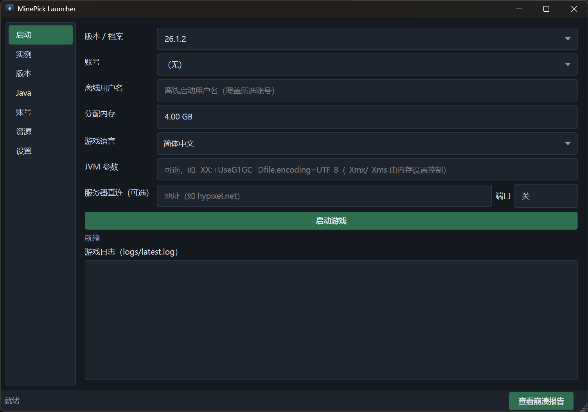
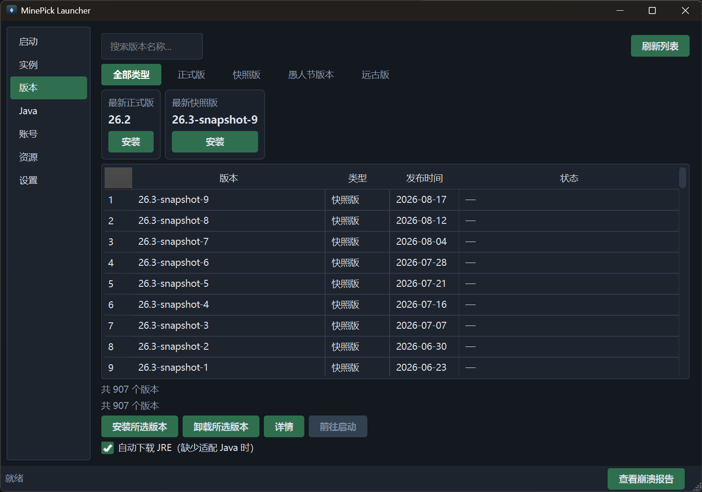
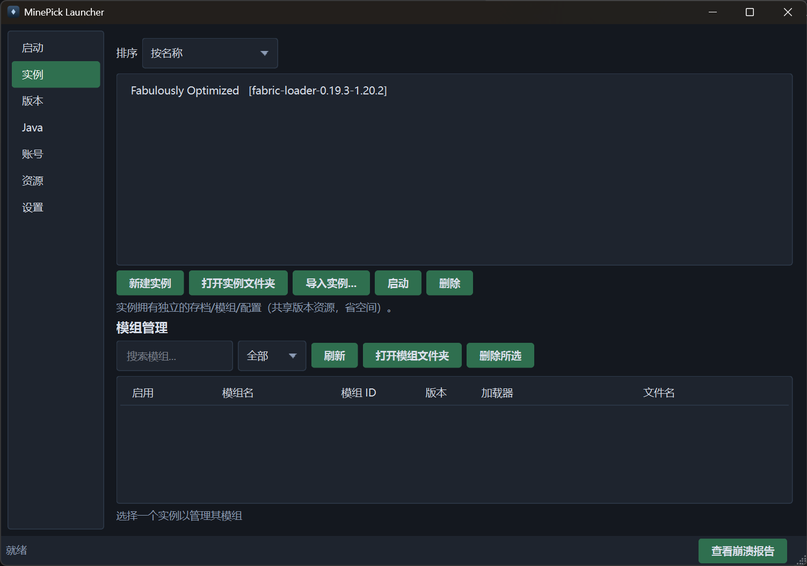
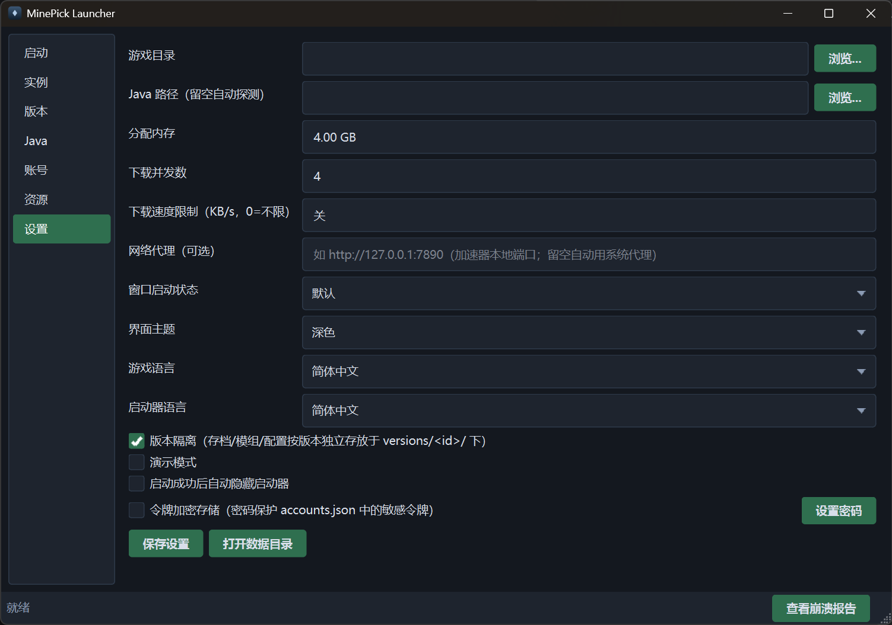

[English](README.md) | 简体中文

# MinePick Launcher

基于 Python + PySide6 的开源 Minecraft 启动器：正版/离线登录、版本安装、Modrinth 模组与整合包、Fabric/Forge/NeoForge 加载器、实例管理，打包为免安装单文件 EXE。

> 许可证：**GPL-3.0**（见 LICENSE）。发布流程见 docs/github_release.md。

## 主要功能

### 账号
- 微软正版登录（设备码流程：自动打开授权页面并复制授权码）
- 多账号管理与一键切换、皮肤头像显示、令牌自动续期
- 令牌加密存储（可选，密码保护）

### 版本与 Java
- 版本页：分类页签（全部 / 正式版 / 快照版 / 愚人节版本 / 远古版）、列出全部官方版本、「最新正式版 / 最新快照版」卡片一键安装、版本名搜索
- 版本详情 / 一键安装卸载
- Java 自动匹配与下载（Adoptium JRE，SHA256 校验），内置 Java 管理页
- 版本隔离：每个版本的存档 / 模组 / 配置独立

### 启动游戏
- 内存（手动或按 mod 数量与可用内存自动分配）/ 游戏语言 / 自定义 JVM 参数 / 服务器直连 / 演示模式
- 实时游戏日志、崩溃报告查看器
- 启动游戏后启动器窗口：保持开启 / 自动隐藏 / 自动退出
- 启动游戏后释放启动器内存（默认开启）；启动前内存不足时提示

### 资源（Modrinth / CurseForge）
- 可切换内容来源：Modrinth / CurseForge（热门 Top 30 展示、关键词搜索、下载量排序）
- 模组 / 资源包 / 光影搜索与安装（关键词 / 下载量排序 / 版本选择）
- 整合包一键安装（自动装加载器 → 建实例 → 下载全部文件并合并 overrides）
- 中文关键词搜索（内置社区公认译名表）
- CurseForge API Key 随构建内置，用户也可在设置页填入自己的 Key

### 加载器与实例
- Fabric / Forge / NeoForge 官方安装器静默安装
- 实例：新建 / 启动 / 删除 / 重命名 / 备注 / 排序 / 导入导出
- 实例本地模组管理：读取 jar 元数据（模组名 / ID / 版本 / 加载器，支持 Fabric / Quilt / NeoForge / Forge / mcmod.info），一键启用/禁用、搜索与状态筛选、拖入 .jar 直接安装、批量删除
- 「查看崩溃报告」按钮直达所选实例的崩溃目录

### 界面与体验
- 界面 9 种语言：简体中文 / 繁體中文 / English / 日本語 / 한국어 / Русский / Français / Español / Deutsch，首次启动自动匹配系统语言，可即时切换
- 深色 / 浅色主题；滚动条视觉隐藏（滚轮照常滚动）
- 首次使用向导（语言 / 游戏目录 / 内存）
- 下载限速、断点续传、实时速率与剩余时间
- 性能：版本列表虚拟化、搜索防抖、热门与配置缓存、懒加载、HTTP 连接复用

## 界面截图

<div align="center">
<table>
  <tr>
    <td></td>
    <td></td>
  </tr>
  <tr>
    <td align="center"><sub>启动页</sub></td>
    <td align="center"><sub>版本页</sub></td>
  </tr>
  <tr>
    <td></td>
    <td></td>
  </tr>
  <tr>
    <td align="center"><sub>实例与本地模组管理</sub></td>
    <td align="center"><sub>设置页</sub></td>
  </tr>
</table>
</div>

## 下载与使用

从 Releases 页下载：
- `MinePick_Launcher.exe` —— 图形界面（双击即用，无控制台窗口）
- `MinePick_Launcher_cli.exe` —— 命令行（终端运行全部命令）

便携模式：EXE 同目录自动生成 `config/` 配置文件夹，两个版本可共用。

命令行示例：
```powershell
MinePick_Launcher_cli.exe login            # 微软正版登录
MinePick_Launcher_cli.exe install 1.20.1   # 安装一个版本
MinePick_Launcher_cli.exe launch 1.20.1    # 启动游戏
MinePick_Launcher_cli.exe --help           # 查看全部命令
```

> 说明：EXE 使用自签名证书签名（WDNDXLTX），其它电脑的 SmartScreen 可能提示“未知发布者”，点击“仍要运行”即可。

## 开发

```powershell
pip install -r requirements-dev.txt
python -m gui                # 运行 GUI
python -m launcher --help    # 运行 CLI
pytest -q                    # 测试（180+）
ruff check launcher gui tests
```

打包与签名：`pyinstaller build_exe.spec` → `scripts/sign_exe.ps1`（详见 docs/code_signing.md）。

## 相关项目

- [MinePick Launcher Revision](https://github.com/TheDarkLord234/MinePick_Launcher_Revision) —— 社区小伙伴基于本项目改制的修订版启动器

## 开源许可

GPL-3.0，见 LICENSE。
