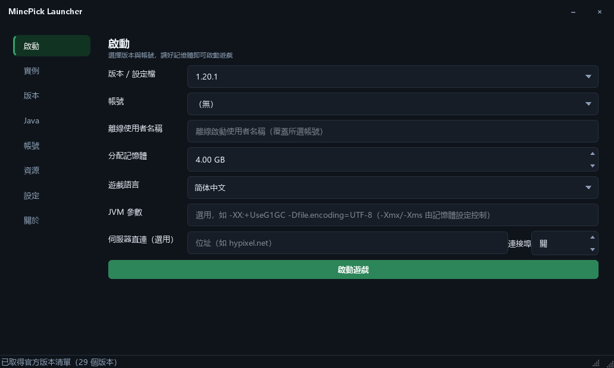
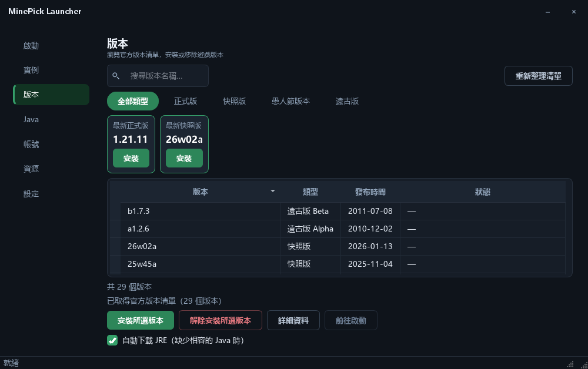
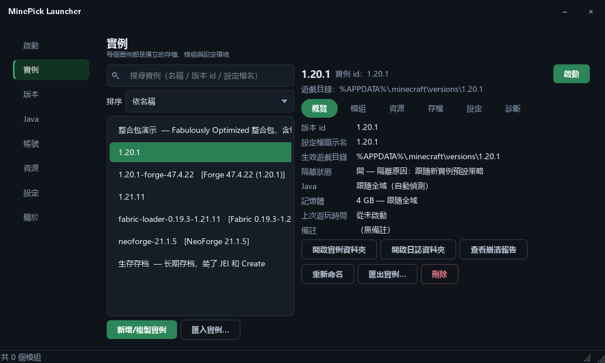
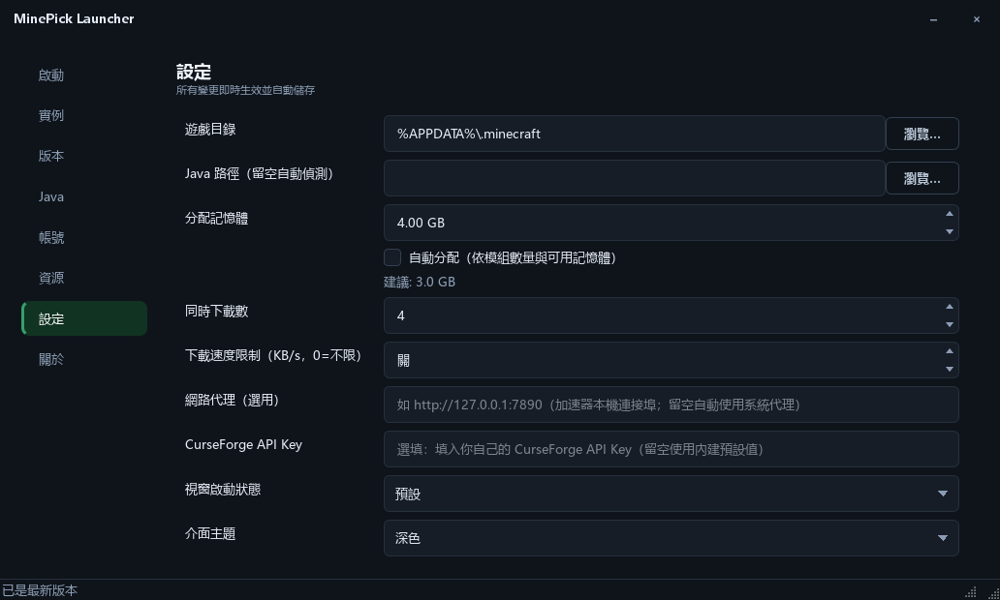

[English](README.md) | [简体中文](README_zh.md) | **繁體中文** | [日本語](README_ja.md) | [한국어](README_ko.md) | [Русский](README_ru.md) | [Français](README_fr.md) | [Español](README_es.md) | [Deutsch](README_de.md)

# MinePick Launcher

以 Python + PySide6 打造的免安裝 Minecraft 啟動器：Microsoft/離線帳號、版本安裝、
Modrinth 與 CurseForge 資源、Fabric/Forge/NeoForge/Quilt 載入器、隔離實例 ——
打包成單一免安裝 EXE。

**目前版本 0.3.0** —— 只提供 GUI 版，本儲存庫不含命令列執行檔。

## 介面截圖

<table>
  <tr>
    <td></td>
    <td></td>
  </tr>
  <tr>
    <td align="center"><sub>啟動</sub></td>
    <td align="center"><sub>版本</sub></td>
  </tr>
  <tr>
    <td></td>
    <td></td>
  </tr>
  <tr>
    <td align="center"><sub>實例與本機模組管理</sub></td>
    <td align="center"><sub>設定（介面個人化）</sub></td>
  </tr>
</table>

## 介面

- **視窗內的首次啟動精靈** —— 歡迎流程是主視窗內的覆蓋層（左側步驟導覽列、右側內容、底部操作列），
  而不是獨立對話方塊，完成後直接關閉並交回主視窗
- **自訂視窗框架** —— 標題列由啟動器自行繪製，因此外觀與主題一致；標題列內不含圖示，
  左側只有視窗標題文字，右側是最小化與關閉按鈕；十字鎬圖示用於工作列、檔案圖示與對話方塊
- **外觀可自訂** —— 強調色（任意 16 進位色碼、八個預設色，或系統取色器）、
  介面字型（所有已安裝字型、常用字型置頂、輸入即篩選）、介面圓角（緊湊 / 預設 / 圓潤）、
  主題（深色 / 淺色 / 跟隨系統）
- **版面更清楚** —— 每一頁都有頁面標題與一行說明、
  所有頁面共用同一套間距尺度、搜尋欄內建放大鏡圖示
- **互動更沉靜** —— 捲軸只在指標移入清單時出現、焦點外框只在鍵盤導覽時顯示、
  切換頁面時短暫淡入、表格欄寬會被記住、點擊表頭即可排序
- **狀態更好讀** —— 按鈕分等級（主要 / 次要 / 外框危險色）、狀態訊息依嚴重程度著色、
  空清單會說明下一步該做什麼
- **預設即無障礙** —— 每一組文字與背景的對比度都符合 WCAG AA（強調色上的白字會自動加深底色），
  介面也提供 9 種語言

## 啟動器功能

### 帳號
- Microsoft 裝置碼登入（自動開啟授權頁面並將代碼複製到剪貼簿），並顯示即時輪詢狀態
- 離線模式、多帳號清單一鍵切換、外觀頭像、權杖自動續期
- 選用的權杖加密（cryptography Fernet + 密碼，支援 `MCLAUNCHER_TOKEN_PASSWORD`）

### 版本與 Java
- 官方版本清單，附分類頁籤（正式版 / 快照版 / 愚人節版本 / 遠古版）、「最新正式版」
  與「最新快照版」卡片、名稱搜尋、一鍵安裝與解除安裝、版本詳細資料
- 版本隔離：每個版本保留自己的存檔 / 模組 / 設定
- Java 需求對應（1.16.5→8、1.17–1.20.4→17、1.20.5–1.21.11→21、26.1+→25），支援 Adoptium
  自動下載與執行階段管理員

### 啟動與實例
- 依模組數量與可用記憶體提供記憶體建議、自訂 JVM 參數、伺服器直連、遊戲語言、
  「啟動遊戲後」行為、釋放啟動器記憶體
- 隔離實例，支援備註、重新命名、匯入/匯出，以及每個實例專屬的本機模組管理（讀取
  Fabric / Quilt / NeoForge / Forge / mcmod.info 的 jar 中介資料、啟用/停用、搜尋與篩選、拖放）

### 資源
- 來自 **Modrinth** 與 **CurseForge** 的模組、資源包、光影與整合包，每個頁籤依下載次數排序的 Top 30、
  關鍵字搜尋（包含中文社群譯名）、一鍵安裝、`.mrpack` 整合包安裝

### 關於與更新
- **「關於」頁**：顯示目前版本、查看原始碼、授權與法律資訊、第三方鳴謝，並內建更新檢查（把本機版本與 GitHub 最新發佈比對）
- **自動更新四種模式**：自動下載並安裝、自動下載並提示（預設）、提示更新、不自動檢查；無法自動安裝時一律回退為開啟發布頁

## 下載與使用

從 Releases 頁面取得 `MinePick_Launcher.exe` 並雙擊執行 —— 免安裝、沒有主控台視窗。
首次執行時會在 EXE 旁邊建立 `config/` 資料夾，因此設定、帳號與實例都留在同一個資料夾裡。

所有設定都在應用程式內調整：**設定即時生效，沒有儲存按鈕。**

> 本建置使用自我簽署憑證（WDNDXLTX），因此其他電腦的 SmartScreen 可能會顯示未知發行者的警告 ——
> 請選擇「更多資訊 → 仍要執行」。

## 開發

```powershell
pip install -r requirements-dev.txt
python -m gui                # run the GUI
pytest -q                    # tests
ruff check launcher gui tests
```

建置與簽署：`pyinstaller build_exe.spec` → `scripts/sign_exe.ps1`（見 `docs/code_signing.md`）。
此 spec 會產生單一 GUI 版 EXE（建置前置條件列於 `docs/github_release.md`）。

一行指令完成介面檢查（測試 + lint + 對比度/溢出/高 DPI + 圓角稽核 + 畫面截圖）：

```powershell
python tools/ui_regression.py            # add --quick to skip the screenshots
```

主題內部機制（預留位置、自訂掛鉤、如何新增選項）：`docs/theming.md`。

## 授權條款

GPL-3.0-only —— 見 [LICENSE](LICENSE)。每次發布隨附的原始碼套件（`Source_code.zip`）
符合 GPL 的原始碼散布要求。

## 相關專案

- [MinePick Launcher Classic](https://github.com/xltxdocs/MinePick_Launcher_Classic) —— 本專案的前身，已封存（GUI + CLI）
- [MinePick Launcher Revision](https://github.com/TheDarkLord234/MinePick_Launcher_Revision) —— 由社群成員製作的修訂版